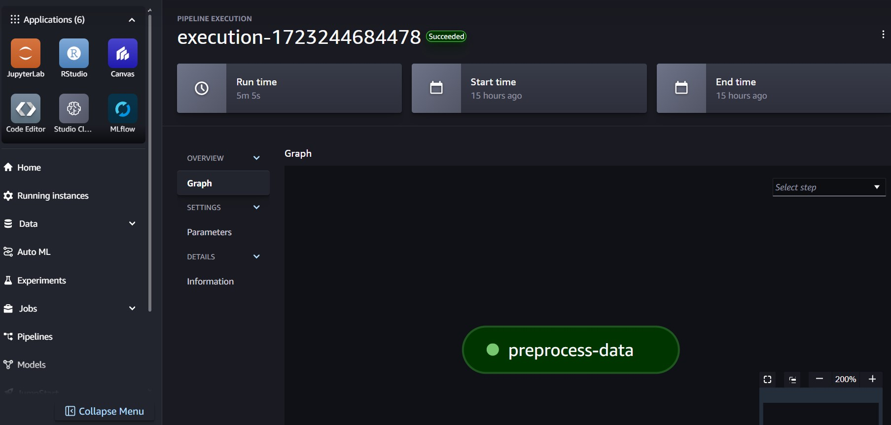
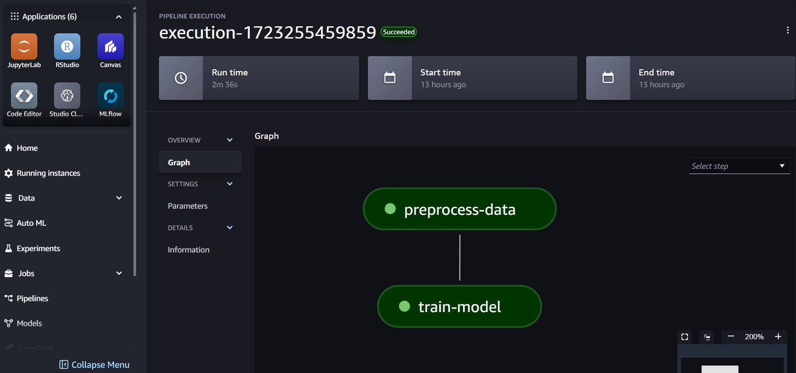

# Predicting Gamer Engagement Levels with AWS

In this post we will go over the basics of training a model with AWS. This is the fundamentals of and end-to-end project, where we will take data from an S3 bucket, clean it with AWS Glue, then run a small training pipeline to train a model on our dataset. The problem here is predicting engagement levels of gamers, for which we can find the data thanks to Kaggle: [Game Behavior Dataset](https://www.kaggle.com/datasets/rabieelkharoua/predict-online-gaming-behavior-dataset).

This post comes from a notebook, and in the repository there is another notebook where we did all the data exploration steps, which you can find here: https://github.com/RavinderRai/gaming-behavior-predictor. That being said, the data here is of high quality, so not too much typical data science work is to be done. Rather the focus is on runing through the full data science life cycle using AWS. But you can of course use this tutorial as a template for a more complex dataset/problem.

## Getting Started

First, let's brush over the basics of getting started with AWS: 
 - Naturally, you'll first need to install the [AWS CLI](https://docs.aws.amazon.com/cli/latest/userguide/getting-started-install.html). 
 - Then you will need to create an IAM role within your account.
 - Once you do, find it in the Users tab and click on it 
 - Go to security credientials and create an Access key. You will get both an access key and secret access key. Save them.
 - Then in a command prompt (I used Anaconda Prompt), type in `aws configure`. It will ask you for these keys. It will also ask for some default values afterward, just hit enter to leave these blank. See the below note for an alternative to this.
 - Next, go to the permissions section and give it Sagemaker and Glue access. 
 - Alternatively, if you are just practicing then you can just give yourself Adminstrator access for simplicity. 

After that, log out, and sign back in with your IAM role. Now you will need your Amazon Resource Name (ARN) for sagemaker and glue. To get those:
 - Find the IAM service in you AWS account, and click on it. You can search for it in the search bar on the top left if needed. 
 - Once you're there, click on Roles under Access Management on the side bar.
 - Then you can search for roles, which in this case you will need the `AWSGlueServiceRole` and the `AmazonSageMaker-ExecutionRole`, so type those in. 
 - Finally, get their respective ARNs and save them in a .env file in your root directory.

The last thing to do is create a bucket in S3, create a folder in it called raw_data, and store the Kaggle dataset there. You can download it locally first here: [Game Behavior Dataset](https://www.kaggle.com/datasets/rabieelkharoua/predict-online-gaming-behavior-dataset). You will need the bucket name of your S3 bucket too, which you can put in your .env file as well, or just define the variable here.

**Note:** you can also input your access keys here when connecting to AWS services. See below for an example.


```python
"""
from dotenv import load_dotenv
import boto3

load_dotenv('.env')

aws_access_key = os.environ["AWS_ACCESS_KEY"]
aws_secret_access_key = os.environ["AWS_SECRET_ACCESS_KEY"]

s3 = boto3.client(
    's3',
    aws_access_key_id=aws_access_key,
    aws_secret_access_key=aws_secret_access_key,
)
"""
```

Now let's load in the necessary imports and environment variables. You should also load the AWS keys here if you are going that route.


```python
%load_ext dotenv
%dotenv

import os
import sys
import boto3
from pathlib import Path

# Change to root directory
os.chdir('..')

# Create a folder for all our code
SRC_PATH = Path("src")
sys.path.extend([f"./{SRC_PATH}"])

# And we'll need our role's
glue_role = os.getenv('GLUE_ROLE')
sagemaker_role = os.getenv('SAGEMAKER_ROLE')
bucket = os.getenv('BUCKET')
```

## Glue

Here we are going to load in our raw data, clean it, and then save that new cleaned version in S3 again. This way we don't overwrite our original data. To make the scripts, we will actually write the files here and then create .py files out of them in a specified directory. This is the point in the SRC_PATH, as that will contain all of our relevant scripts to deploy to AWS.


```python
(SRC_PATH / "etl").mkdir(parents=True, exist_ok=True)
sys.path.extend([f"./{SRC_PATH}/etl"])
```


```python
%%writefile {SRC_PATH}/etl/script.py

import sys
from awsglue.transforms import *
from awsglue.utils import getResolvedOptions
from pyspark.context import SparkContext
from awsglue.context import GlueContext
from awsglue.job import Job
import pandas as pd
from io import StringIO
import boto3

args = getResolvedOptions(sys.argv, ['JOB_NAME', 'INPUT_BUCKET', 'INPUT_KEY', 'OUTPUT_BUCKET', 'OUTPUT_KEY'])
sc = SparkContext()
glueContext = GlueContext(sc)
spark = glueContext.spark_session
job = Job(glueContext)
job.init(args['JOB_NAME'], args)

# Read data from S3
s3_client = boto3.client('s3')
obj = s3_client.get_object(Bucket=args['INPUT_BUCKET'], Key=args['INPUT_KEY'])
df = pd.read_csv(StringIO(obj['Body'].read().decode('utf-8')))

#target label encoding
df['EngagementLevel'] = df['EngagementLevel'].map({'Low': 0, 'Medium': 1, 'High': 2})

# Perform transformations to independent variables
df['Gender'] = df['Gender'].map({'Male': 1, 'Female': 0})
df['GameDifficulty'] = df['GameDifficulty'].map({'Easy': 0, 'Medium': 1, 'Hard': 2})
df_encoded = pd.get_dummies(df, columns=['Location', 'GameGenre'], drop_first=True)

encoded_cols = list(set(df_encoded.columns) - set(df.columns))
df_encoded[encoded_cols] = df_encoded[encoded_cols].astype(int)

# Convert the DataFrame back to CSV
csv_buffer = StringIO()
df_encoded.to_csv(csv_buffer, index=False)

# Upload the transformed data to S3
s3_client.put_object(Bucket=args['OUTPUT_BUCKET'], Key=args['OUTPUT_KEY'], Body=csv_buffer.getvalue())

job.commit()
```

    Overwriting src/etl/script.py
    

The following code is standard code to run the above script in Glue. The main things you'll need are your bucket name, paths to where the raw data is stored and where to store the transformed data. You can modify these as you like.


```python
file_path = f"{(SRC_PATH / 'etl' / 'script.py').as_posix()}"
s3_client = boto3.client('s3')
bucket_name = 'gaming-behavior'
script_file_name = 'script.py'
s3_key = f'glue-scripts/{script_file_name}'

# Upload the script to S3
s3_client.upload_file(file_path, bucket_name, s3_key)
#print(f'Script uploaded to s3://{bucket_name}/{s3_key}')


glue_client = boto3.client('glue')

# Parameters for the Glue job
job_name = 'etl-job'
script_location = f's3://{bucket_name}/{s3_key}'

# S3 locations for input and output data
input_bucket = 'gaming-behavior'
input_key = 'raw_data/online_gaming_behavior_dataset.csv'
output_bucket = 'gaming-behavior'
output_key = 'transformed_data/transformed_online_gaming_behavior_dataset.csv'

# Create or update the Glue job
response = glue_client.create_job(
    Name=job_name,
    Role=glue_role,
    Command={
        'Name': 'glueetl',
        'ScriptLocation': script_location,
        'PythonVersion': '3'
    },
    DefaultArguments={
        '--job-language': 'python',
        '--enable-continuous-cloudwatch-log': 'true',
        '--enable-spark-ui': 'true',
        '--INPUT_BUCKET': input_bucket,
        '--INPUT_KEY': input_key,
        '--OUTPUT_BUCKET': output_bucket,
        '--OUTPUT_KEY': output_key
    },
    MaxRetries=0,
    MaxCapacity=2.0,
    Timeout=2880,
    GlueVersion='2.0'
)

print(f'Glue job {job_name} created successfully')

```

    Script uploaded to s3://gaming-behavior/glue-scripts/script.py
    

Here we actually run the Glue job, which will process the data as we instructed in our script and sstore the transformed data into the same S3 bucket. You double-check to see if it worked on your AWS account. 


```python
start_response = glue_client.start_job_run(JobName=job_name)
print(f'Glue job {job_name} started successfully with run ID: {start_response["JobRunId"]}')
```

    Glue job etl-job started successfully with run ID: jr_195ff9faba49f0f2b2324e1d2fa90e9672d0b305ba6b92941a48b8b49e9eb36d
    

## Sagemaker

Here we will start the training pipeline in sagemaker. If you're not familiar, a pipeline is just a sequence of steps that we run through in order. Sagemaker can put them together nicely, and doing it this way helps with reproducibility and scalability.

### Pre-processing

Now we will preprocess the data in Sagemaker and start a small pipeline (it will just be the preprocessing and training steps for now). In our case here, the data was already of high quality, so most cleaning steps were done in the glue job. It might seem redundant here to have a Glue job and pre-processing job, but typically the preprocessing step involves data transformation and feature engineering, specifically in preparation for a model, so it's good practice to separate these things.


```python
import sagemaker
from sagemaker.workflow.parameters import ParameterString
from sagemaker.workflow.pipeline_definition_config import PipelineDefinitionConfig
from sagemaker.workflow.pipeline_context import PipelineSession
from sagemaker.workflow.steps import CacheConfig
from sagemaker.sklearn.processing import SKLearnProcessor
from sagemaker.processing import ProcessingInput, ProcessingOutput
from sagemaker.workflow.steps import ProcessingStep
from sagemaker.workflow.pipeline import Pipeline

# don't redo steps if already done from previous failed jobs
cache_config = CacheConfig(enable_caching=True, expire_after="15d")

S3_LOCATION = f"s3://{bucket}"

sm_boto3 = boto3.client("sagemaker")
pipeline_session = PipelineSession(default_bucket=bucket)
sagemaker_session = sagemaker.session.Session()
region = sagemaker_session.boto_session.region_name
```

    sagemaker.config INFO - Not applying SDK defaults from location: C:\ProgramData\sagemaker\sagemaker\config.yaml
    sagemaker.config INFO - Not applying SDK defaults from location: C:\Users\RaviB\AppData\Local\sagemaker\sagemaker\config.yaml
    

We are keeping all scripts in the same folder, so make sure that folder has subfolders for each job. If it does, then ignore it.


```python
(SRC_PATH / "preprocessing").mkdir(parents=True, exist_ok=True)
sys.path.extend([f"./{SRC_PATH}/preprocessing"])
```


```python
%%writefile {SRC_PATH}/preprocessing/script.py

from pathlib import Path
import numpy as np
import pandas as pd
from sklearn.model_selection import train_test_split


def preprocess(base_directory):
    """Load the supplied data, split it and transform it."""
    df = _read_data_from_input_csv_files(base_directory)

    # the only transformation we need to do is drop the player id and split the data
    # everything else was done in the etl script
    
    df = df.drop(columns=['PlayerID'])
    df_train, df_test = train_test_split(df, test_size=0.2)

    y_train = df_train.EngagementLevel
    y_test = df_test.EngagementLevel

    X_train = df_train.drop("EngagementLevel", axis=1)
    X_test = df_test.drop("EngagementLevel", axis=1)

    _save_splits(base_directory, X_train, y_train, X_test, y_test)


def _read_data_from_input_csv_files(base_directory):
    """Read the data from the input CSV files.

    This function reads every CSV file available and
    concatenates them into a single dataframe.
    """
    input_directory = Path(base_directory) / "input"
    files = list(input_directory.glob("*.csv"))

    if len(files) == 0:
        message = f"The are no CSV files in {input_directory.as_posix()}/"
        raise ValueError(message)

    raw_data = [pd.read_csv(file) for file in files]
    df = pd.concat(raw_data)

    # Shuffle the data
    return df.sample(frac=1, random_state=42)


def _save_splits(base_directory, X_train, y_train, X_test, y_test):
    """Save data splits to disk.

    This function combines the transformed features
    and the target variable, and saves them separately
    as training and testing sets.
    """
    train = pd.concat([X_train, y_train], axis=1)
    test = pd.concat([X_test, y_test], axis=1)

    train_path = Path(base_directory) / "train"
    test_path = Path(base_directory) / "test"

    train_path.mkdir(parents=True, exist_ok=True)
    test_path.mkdir(parents=True, exist_ok=True)

    pd.DataFrame(train).to_csv(train_path / "train.csv", header=True, index=False)
    pd.DataFrame(test).to_csv(test_path / "test.csv", header=True, index=False)


if __name__ == "__main__":
    preprocess(base_directory="/opt/ml/processing")

```

    Overwriting src/preprocessing/script.py
    

The next blocks of code are defining our jobs. For the instance type, you can use ml.t3.medium, or you can use other's like ml.m5.xlarge. You can't use ml.m5.xlarge by default though - you'll have to request a limit increase, but it is noticeably faster than the former. 


```python
pipeline_definition_config = PipelineDefinitionConfig(use_custom_job_prefix=True)

dataset_location = ParameterString(
    name="dataset_location",
    default_value=f"{S3_LOCATION}/transformed_data",
)

processor = SKLearnProcessor(
    base_job_name="preprocess-data",
    framework_version="1.2-1",
    instance_type="ml.t3.medium",
    instance_count=1,
    role=sagemaker_role,
    sagemaker_session=pipeline_session,
)
```

Here we define the processing step. You can change the name, but the important part here is the outputs. Decide on a file path and add more/less for you task. You can also modify the input if needed too.


```python
preprocessing_step = ProcessingStep(
    name="preprocess-data",
    step_args=processor.run(
        code=f"{(SRC_PATH / 'preprocessing' / 'script.py').as_posix()}",
        inputs=[
            ProcessingInput(
                source=dataset_location,
                destination="/opt/ml/processing/input",
            ),
        ],
        outputs=[
            ProcessingOutput(
                output_name="train",
                source="/opt/ml/processing/train",
                destination=f"{S3_LOCATION}/preprocessing/train",
            ),
            ProcessingOutput(
                output_name="test",
                source="/opt/ml/processing/test",
                destination=f"{S3_LOCATION}/preprocessing/test",
            )
        ],
    ),
    cache_config=cache_config
)

# now create the pipeline using the processing step above
preprocessing_pipeline = Pipeline(
    name="preprocessing-pipeline-pipeline",
    parameters=[dataset_location],
    steps=[
        preprocessing_step,
    ],
    pipeline_definition_config=pipeline_definition_config,
    sagemaker_session=pipeline_session,
)

# this will push the pipeline to AWS 
preprocessing_pipeline.upsert(role_arn=sagemaker_role)
```

    c:\Users\RaviB\anaconda3\envs\sagemaker_mini\lib\site-packages\sagemaker\workflow\pipeline_context.py:332: UserWarning: Running within a PipelineSession, there will be No Wait, No Logs, and No Job being started.
      warnings.warn(
    

This next line will start or execute the pipeline in Sagemaker. If you run it, go to you sagemaker account and click on the pipelines section. You should see it there. It will be a certain color depending on it's stage. In this case, it should run in just a few minutes.


```python
preprocessing_pipeline.start()
```


    _PipelineExecution(arn='arn:aws:sagemaker:us-east-1:590184030535:pipeline/preprocessing-pipeline-pipeline/execution/s1jgyqqf52mq', sagemaker_session=<sagemaker.workflow.pipeline_context.PipelineSession object at 0x00000139112D8040>)


You should see this:




### Modeling

Now for modeling we do the same thing as before: create a folder in SRC for the training script, and then define the pipeline. Note in the training script, you'll see things like os.environ["SM_MODEL_DIR"], os.environ["SM_CHANNEL_TRAIN"], and os.environ["SM_CHANNEL_TEST"]. These are file paths that are standard to Sagemaker, so leave these as it.


```python
(SRC_PATH / "modeling").mkdir(parents=True, exist_ok=True)
sys.path.extend([f"./{SRC_PATH}/modeling"])
```


```python
%%writefile {SRC_PATH}/modeling/script.py

import argparse
import os
import json
import pandas as pd
import xgboost as xgb
from sklearn.metrics import accuracy_score, cohen_kappa_score
from pathlib import Path
import joblib
import tarfile


def train(model_directory, train_path, test_path, learning_rate=0.1, max_depth=7,):
    """This function trains an XGBoost model and saves it in the S3 bucket."""

    # get the training set, get the final column (target) 
    # and then drop it to get the X_train set
    X_train = pd.read_csv(Path(train_path) / "train.csv")
    y_train = X_train[X_train.columns[-1]]
    X_train = X_train.drop(X_train.columns[-1], axis=1)

    # repeat for testing set
    X_test = pd.read_csv(Path(test_path) / "test.csv")
    y_test = X_test[X_test.columns[-1]]
    X_test = X_test.drop(X_test.columns[-1], axis=1)

    model = xgb.XGBClassifier(objective='multi:softmax', num_class=3, eval_metric='mlogloss', learning_rate=learning_rate, max_depth=max_depth)
    model.fit(X_train, y_train)

    y_pred = model.predict(X_test)

    accuracy = accuracy_score(y_test, y_pred)
    kappa = cohen_kappa_score(y_test, y_pred)

    # Just printing these for now, but ideally you would log these with something like MLflow
    print("kappa score:", accuracy)
    print("kappa score:", kappa)

    model_path = (Path(model_directory) / "game-behavior-model")
    model.save_model(model_path)


# here we define arguements to take as input, which are just hyperparameters.
if __name__ =='__main__':
    print("[INFO] Extracting arguements")
    parser = argparse.ArgumentParser()

    # hyperparameters sent by the client are passed as command-line arguments to the script.
    parser.add_argument('--learning_rate', type=float, default=0.1)
    parser.add_argument('--max_depth', type=int, default=7)

    args, _ = parser.parse_known_args()

    print("[INFO] Training...")
    train(
        model_directory=os.environ["SM_MODEL_DIR"],
        train_path=os.environ["SM_CHANNEL_TRAIN"],
        test_path=os.environ["SM_CHANNEL_TEST"],
        learning_rate=args.learning_rate,
        max_depth=args.max_depth,
    )

    print("[INFO] Saving Model")
    model_path = Path(os.environ["SM_MODEL_DIR"])
    tar_path = model_path / "model.tar.gz"

    with tarfile.open(tar_path, "w:gz") as tar:
        tar.add(model_path / "game-behavior-model", arcname="game-behavior-model")
```

    Overwriting src/modeling/script.py
    

Creating the pipeline for XGBoost training is a bit different, as we define an estimator that is specific to XGBoost (sagemaker has it built in already). We just need to define the hyperameters here though, and the instance type if you want to change it.


```python
from sagemaker.inputs import TrainingInput
from sagemaker.workflow.steps import TrainingStep
from sagemaker.xgboost import XGBoost

estimator = XGBoost(
    entry_point="script.py",
    source_dir=f"{(SRC_PATH / 'modeling').as_posix()}",
    hyperparameters={
        "learning_rate": 0.1,
        "max_depth": 7,
    },
    framework_version="1.2-1",
    py_version="py3",
    instance_type="ml.m5.xlarge",
    instance_count=1,
    role=sagemaker_role,
    sagemaker_session=pipeline_session,
)
```

    INFO:sagemaker.image_uris:Ignoring unnecessary Python version: py3.
    INFO:sagemaker.image_uris:Ignoring unnecessary instance type: ml.m5.xlarge.
    

For the training step, we need to get the inputs from the processing step, which are the training and testing sets.


```python
def create_training_step(estimator):
    """Create a SageMaker TrainingStep using the provided estimator."""
    return TrainingStep(
        name="train-model",
        step_args=estimator.fit(
            inputs={
                "train": TrainingInput(
                    s3_data=preprocessing_step.properties.ProcessingOutputConfig.Outputs[
                        "train"
                    ].S3Output.S3Uri,
                    content_type="text/csv",
                ),
                "test": TrainingInput(
                    s3_data=preprocessing_step.properties.ProcessingOutputConfig.Outputs[
                        "test"
                    ].S3Output.S3Uri,
                    content_type="text/csv",
                )
            },
        ),
        #cache_config=cache_config
    )

train_model_step = create_training_step(estimator)
```

    c:\Users\RaviB\anaconda3\envs\sagemaker_mini\lib\site-packages\sagemaker\workflow\pipeline_context.py:332: UserWarning: Running within a PipelineSession, there will be No Wait, No Logs, and No Job being started.
      warnings.warn(
    

The pipeline is the same as before, but this time we have two steps to run through sequentially.


```python
train_pipeline = Pipeline(
    name="train-pipeline",
    parameters=[dataset_location],
    steps=[
        preprocessing_step,
        train_model_step,
    ],
    pipeline_definition_config=pipeline_definition_config,
    sagemaker_session=pipeline_session,
)

train_pipeline.upsert(role_arn=sagemaker_role)
```


    {'PipelineArn': 'arn:aws:sagemaker:us-east-1:590184030535:pipeline/train-pipeline',
     'ResponseMetadata': {'RequestId': '2d5f7d5d-d72a-4803-a348-0287d1ca718c',
      'HTTPStatusCode': 200,
      'HTTPHeaders': {'x-amzn-requestid': '2d5f7d5d-d72a-4803-a348-0287d1ca718c',
       'content-type': 'application/x-amz-json-1.1',
       'content-length': '82',
       'date': 'Sat, 10 Aug 2024 02:04:19 GMT'},
      'RetryAttempts': 0}}


Again, this will start the pipeline. Now you will have two steps and should see that in sagemaker.


```python
train_pipeline.start()
```


    _PipelineExecution(arn='arn:aws:sagemaker:us-east-1:590184030535:pipeline/train-pipeline/execution/2c3o93ju326g', sagemaker_session=<sagemaker.workflow.pipeline_context.PipelineSession object at 0x0000017BBE496BB0>)


If it works successfully, you should see this:



### Testing the Model

Now let's access that model in our S3 bucket and test it to make sure it works locally. Note that sagemaker's latest version of XGBoost is 1.7.1, so you might want to use that instead of anything later.


```python
import boto3
import pandas as pd
from io import StringIO
import tarfile
import numpy as np
import xgboost as xgb
```

For the sake of consistency, let's also test the data we transformed and stored in S3. So we'll load the test set we made in S3, and get a sample from it for testing our model prediction.


```python
# accessing s3
s3 = boto3.client('s3')

# the path to the test.csv file in s3
file_key = 'preprocessing/test/test.csv'

# Download the file content to a string
csv_obj = s3.get_object(Bucket=bucket, Key=file_key)
body = csv_obj['Body']
csv_string = body.read().decode('utf-8')

# Use StringIO to create a file-like object
df_test = pd.read_csv(StringIO(csv_string))
df_test.head()
```


<div>
<style scoped>
    .dataframe tbody tr th:only-of-type {
        vertical-align: middle;
    }

    .dataframe tbody tr th {
        vertical-align: top;
    }

    .dataframe thead th {
        text-align: right;
    }
</style>
<table border="1" class="dataframe">
  <thead>
    <tr style="text-align: right;">
      <th></th>
      <th>Age</th>
      <th>Gender</th>
      <th>PlayTimeHours</th>
      <th>InGamePurchases</th>
      <th>GameDifficulty</th>
      <th>SessionsPerWeek</th>
      <th>AvgSessionDurationMinutes</th>
      <th>PlayerLevel</th>
      <th>AchievementsUnlocked</th>
      <th>Location_Europe</th>
      <th>Location_Other</th>
      <th>Location_USA</th>
      <th>GameGenre_RPG</th>
      <th>GameGenre_Simulation</th>
      <th>GameGenre_Sports</th>
      <th>GameGenre_Strategy</th>
      <th>EngagementLevel</th>
    </tr>
  </thead>
  <tbody>
    <tr>
      <th>0</th>
      <td>34</td>
      <td>1</td>
      <td>0.463154</td>
      <td>0</td>
      <td>1</td>
      <td>14</td>
      <td>28</td>
      <td>38</td>
      <td>38</td>
      <td>0</td>
      <td>0</td>
      <td>1</td>
      <td>0</td>
      <td>0</td>
      <td>0</td>
      <td>1</td>
      <td>1</td>
    </tr>
    <tr>
      <th>1</th>
      <td>21</td>
      <td>1</td>
      <td>11.808281</td>
      <td>0</td>
      <td>0</td>
      <td>3</td>
      <td>45</td>
      <td>61</td>
      <td>20</td>
      <td>0</td>
      <td>0</td>
      <td>1</td>
      <td>0</td>
      <td>1</td>
      <td>0</td>
      <td>0</td>
      <td>0</td>
    </tr>
    <tr>
      <th>2</th>
      <td>36</td>
      <td>1</td>
      <td>15.990206</td>
      <td>0</td>
      <td>1</td>
      <td>16</td>
      <td>123</td>
      <td>99</td>
      <td>1</td>
      <td>0</td>
      <td>1</td>
      <td>0</td>
      <td>0</td>
      <td>0</td>
      <td>0</td>
      <td>0</td>
      <td>2</td>
    </tr>
    <tr>
      <th>3</th>
      <td>19</td>
      <td>0</td>
      <td>10.984578</td>
      <td>0</td>
      <td>0</td>
      <td>0</td>
      <td>160</td>
      <td>64</td>
      <td>11</td>
      <td>1</td>
      <td>0</td>
      <td>0</td>
      <td>1</td>
      <td>0</td>
      <td>0</td>
      <td>0</td>
      <td>0</td>
    </tr>
    <tr>
      <th>4</th>
      <td>15</td>
      <td>1</td>
      <td>19.290249</td>
      <td>0</td>
      <td>2</td>
      <td>19</td>
      <td>71</td>
      <td>37</td>
      <td>16</td>
      <td>0</td>
      <td>0</td>
      <td>1</td>
      <td>0</td>
      <td>1</td>
      <td>0</td>
      <td>0</td>
      <td>0</td>
    </tr>
  </tbody>
</table>
</div>


Remember the test set has our target variable still, so we need to drop that, and then let's just take the first row for a sample, as well as the first few rows for multiple predictions.


```python
X_test = df_test.drop(columns='EngagementLevel')
sample = X_test.iloc[0:1]
samples = X_test.iloc[0:5]
```

Now to get the model from S3, we also need that file path, and we will download it locally. Something else you could do is deploy it as an endpoint, but be sure to be careful there as that can incur charges (really only if you don't delete the endpoint). In any case, we'll stick with downloading locally for now. So just create a folder called `local_model_dir` and put the model there.


```python
object_key = 'sagemaker-xgboost-2c3o93ju326g-5ZFBV9xhF3/output/model.tar.gz'
local_file_name = 'local_model_dir/model'
s3.download_file(bucket, object_key, 'local_model_dir/model')
```

Next we need to extract the model, and then we can use xgb.Booster to initiate an empty XGBoost object, and then we load the parameters from the file we just extracted.


```python
with tarfile.open(local_file_name, 'r:gz') as tar:
    tar.extractall(path='local_model_dir')

model = xgb.Booster()
model.load_model('local_model_dir/game-behavior-model')
```

Keep in mind that now XGBoost takes a dmatrix as object, so we need to input that, but otherwise we are making a prediction based on our sample as normal. Also remember it will output a probability distribution, so we need to take the argmax to get the actual engagement level prediction, which has 3 classes, Low, Medium, and High, with 0, 1, and 2 as labels, respectively.


```python
sample = xgb.DMatrix(sample)

prediction = model.predict(sample)
prediction = np.argmax(prediction, axis=1)
prediction
```


    array([1], dtype=int64)


So that's it. We cleaned the data, split it into training and testing sets, and trained a model all within sagemaker. There's plenty more you can do afterward but we'll wrap up here by getting multiple predictions.


```python
samples = xgb.DMatrix(samples)

predictions = model.predict(samples)

predictions = np.argmax(predictions, axis=1)
predictions
```


    array([1, 0, 2, 0, 1], dtype=int64)


